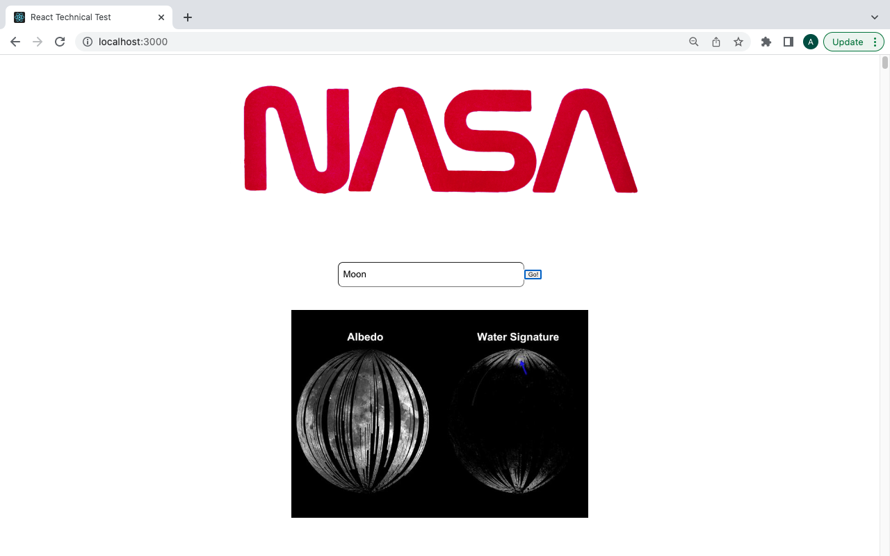
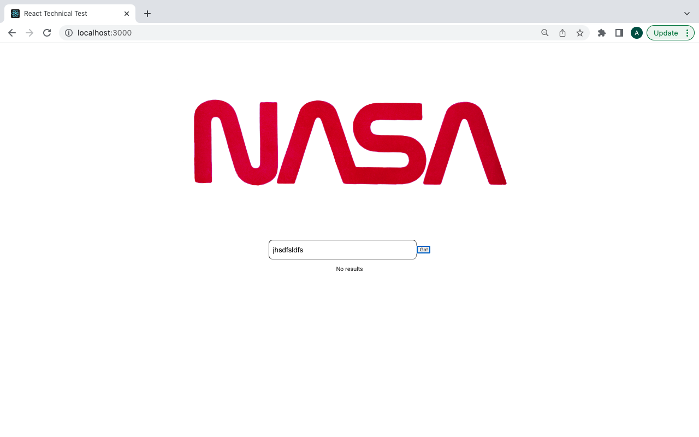

# React Technical Test

As part of the Manchester Codes front-end module, the brief was to build a React web application that allows users to search for images in the NASA image database, based on a query entered into a search bar. It uses the API endpoint provided as part of the brief.

The user is able to enter a keyword i.e. 'Moon' or 'Pluto' to search for relevant images. Images relating to the keyword will appear under the search bar.  If an invalid keyword i.e. jkdfakfak is entered, it will return with an error message displaying "No results" 

The Test-Driven Development (TDD) method was used to test the functionality of the app by using React Testing Library.

## Screenshots





## How the app was built

### To build

- React

### Testing utilities used

- Jest
- React Testing Library

### Additional packages used

- Axios
- PropTypes

## Instructions on how to run the app 

1. Clone this repo:

    ``` bash
    git clone git@github.com:AnnaC200/tech-test.git
    ```

2. Install the project dependencies:

    ``` bash
    npm install
    ```

3. Start the React app:

    ``` bash
     npm start
    ```

## What i would do if i had more time

- Make the app responsive to different media types 
- Add additional CSS styling to make the app look more visually appealing
- Create more events to the button

## Author

[Anna Chan](https://twitter.com/annachan200)
